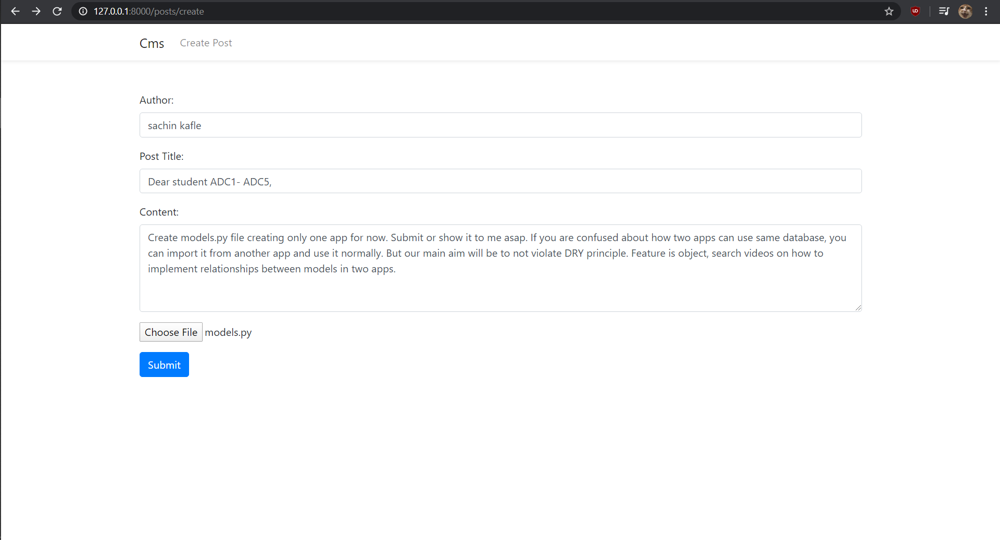
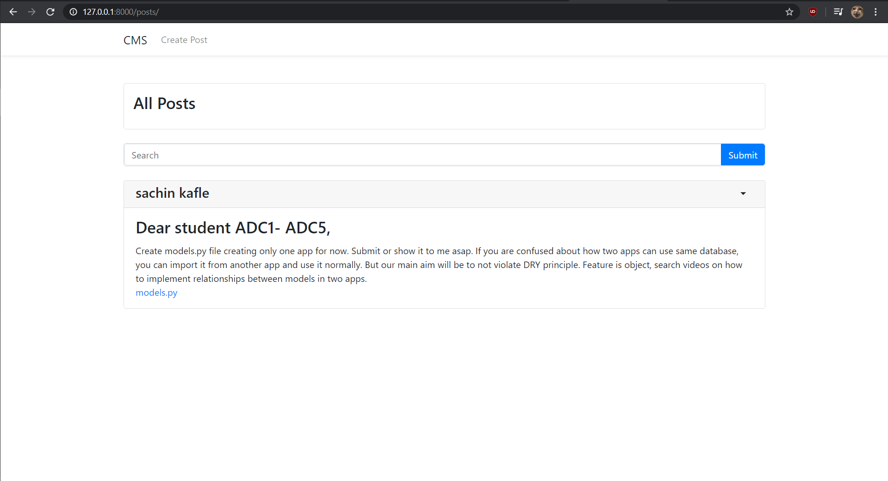
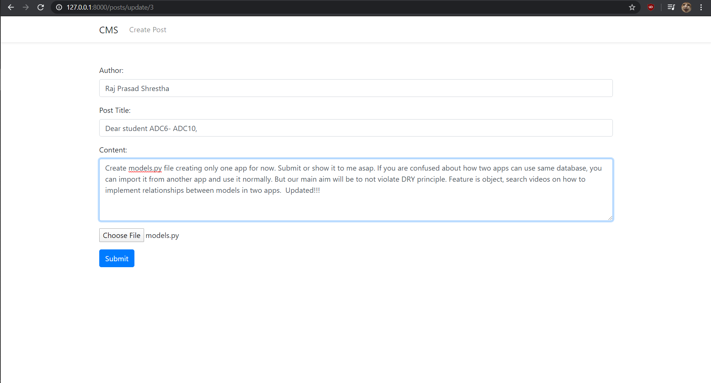
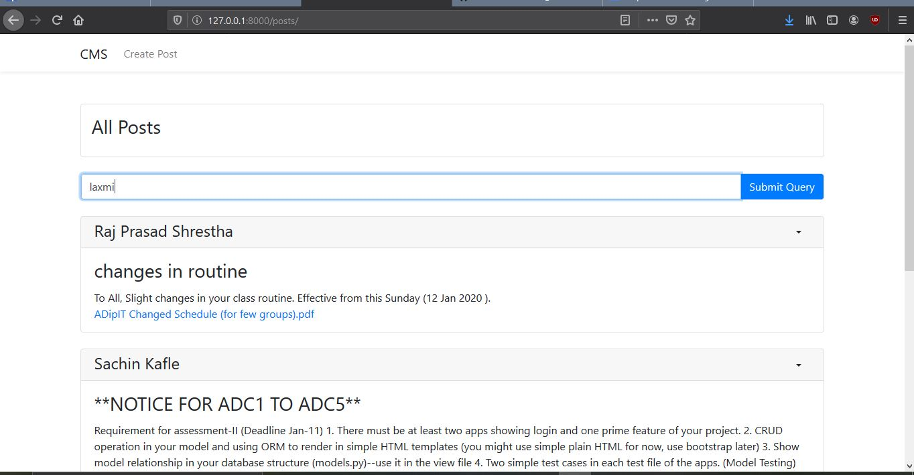
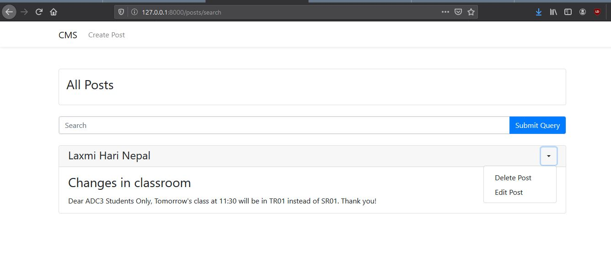
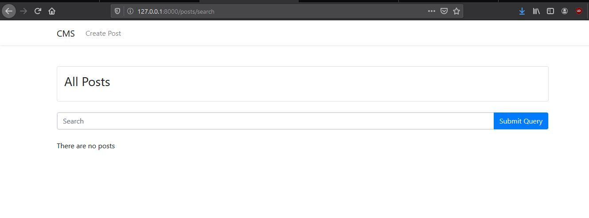
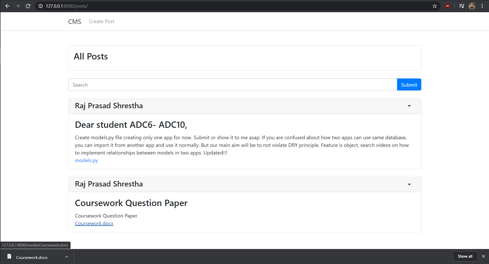

# SNS_ADC10

## Project Title: Classroom assignment system

### Team Members:
1. Subash Khadka
2. Nitesh Manandhar
3. Shuva Shrestha

---

## Testing:
Create post form:

Showing created posts

Edit button

Update post form

Showing updated form

Searching Posts

Search Results

Delete Button

Search Results

Downloading File

